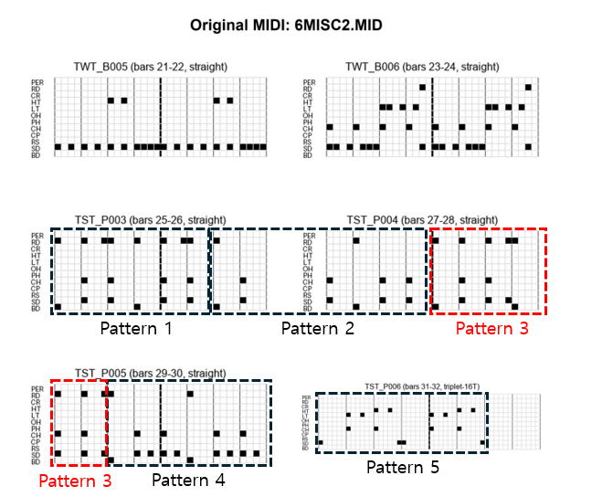

# Design Trade-offs in ADP: Fixed Steps and 2-Bar Patterns

## Overview

The current ADP system was deliberately designed around a fixed-step, two-bar pattern model optimized for simplicity, repeatability, and reliable playback in constrained environments. While this design has proven effective for a large class of 4/4-based drum patterns, it inevitably introduces limitations when confronted with more diverse rhythmic structures.

This document outlines several known trade-offs and limitations that arise from these design choices, with an emphasis on transparency rather than completeness.

---

## Fixed-Step, Two-Bar Assumption

ADP assumes a constant step grid and a fixed two-bar pattern length.  
This assumption simplifies pattern reuse, indexing, and embedded playback, but it also constrains how meter and rhythmic subdivision can be represented.

Patterns that do not naturally conform to a regular 4/4 grid must therefore be approximated rather than faithfully represented.

---

## Lack of Native Support for Triple Meter (3/4)

At present, the ADP system does not natively support triple-meter patterns such as 3/4.

When analyzing MIDI files that contain waltz-like material but lack explicit time signature metadata, such sections may be forcibly segmented and approximated as 4/4 patterns. In practice, this involves redistributing beats or padding unused steps in order to fit the fixed grid.

While this approach produces mechanically valid ADP patterns, it can distort the original rhythmic intent. Musical correctness is sacrificed in favor of structural compatibility, and this limitation is explicitly acknowledged.

The following image illustrates a case in which a 3/4 waltz section contained in the final part of the file `6MISC.MID` was incorrectly segmented as a 4/4 pattern. Even if ADC is improved to accommodate triple meter, this file would still require manual review because the original MIDI file does not contain explicit time signature change information (4/4 → 3/4).

---

## Flam Representation and Triplet Approximation

Flam articulation presents another challenge within the fixed-step framework.

Without a dedicated representation for near-simultaneous grace notes, flams are currently approximated by mapping them onto 16T triplet subdivisions. This preserves relative timing order but fails to capture the expressive nuance of a true flam.

As a result, patterns containing flams often sound more rigid and quantized than their source material. This behavior reflects a conscious compromise imposed by the step-based encoding model.

The following example shows a case in which a flam was interpreted as a sixteenth-note triplet. As a result, a pattern that could have been represented with 24 steps per pattern was unnecessarily expanded to 48 steps per pattern.

---

## 24-Step Patterns and Step Sequencer Limitations

Certain rhythmic styles, such as blues and shuffle-based grooves, naturally align with 24-step or triplet-oriented grids.

Although such patterns can be detected during analysis, the current APS step sequencer does not yet support **interactive editing or visualization** of 24-step patterns.

Importantly, this limitation applies only to step-based editing. **Playback of 24-step patterns within APS is fully supported and functions as expected.**

As a result, these patterns cannot be refined using the step sequencer interface and must either be simplified, converted, or excluded from step-based editing workflows, even though they remain playable within the APS environment.

---

## Summary

The limitations described above are not accidental omissions but direct consequences of deliberate design decisions. By favoring a fixed-step, two-bar model, ADP achieves clarity, consistency, and implementation simplicity at the cost of expressive flexibility.

These trade-offs define the current scope of the system. More complex meters, articulations, and step structures are recognized as important future directions, but addressing them meaningfully would require fundamental changes to the underlying model.

---

## Closing Note

Rather than attempting to approximate all rhythmic structures within a single abstraction, the ADP system explicitly accepts its current boundaries. This clarity of scope is intended to support long-term evolution without compromising the stability of existing patterns and tools.
