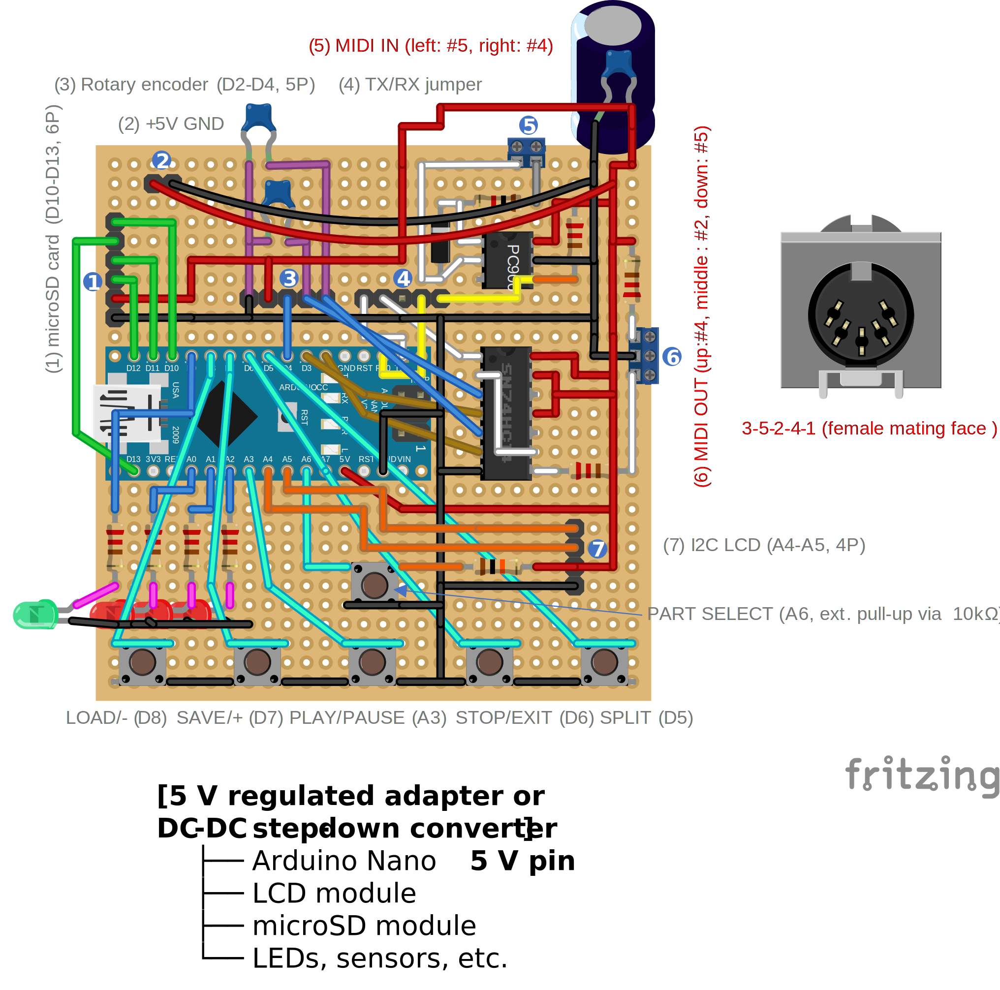
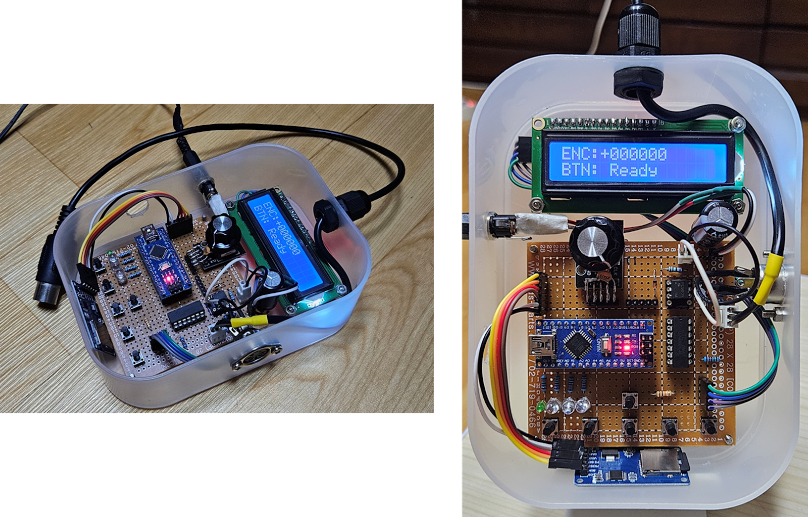

# Hardware

This document provides a minimal overview of the Nano Ardule hardware.
Only the wiring diagram, MIDI schematic, and pin mapping are described here.
For design rationale and firmware behavior, refer to the main [`README`](../README.md).

---

## Wiring Diagram

---

## MIDI Interface Schematic

---

## Notes on Special Pins

### UART RX/TX and Jumper Isolation

Pins **D0 (RX)** and **D1 (TX)** are used for **MIDI IN** and **MIDI OUT**.
On the classic Arduino Nano, these pins are shared with the USB serial interface used for firmware upload.

To avoid conflicts during upload, the MIDI connection to D0/D1 is routed through jumper headers:
- During firmware upload, the jumpers are disconnected
- After upload, the jumpers are reconnected for normal MIDI operation

This workaround is **not required** when using the **Arduino Nano Every**, employs a separate USB interface and does not share D0/D1 with USB serial communication.

### A6 (PART SELECT Button)

Pin **A6** is an **analog-input-only pin** and is therefore well suited for use as a button input.

Because A6 does not support the internal pull-up resistor, an **external pull-up resistor is required** when using this pin.

---

## Pin Mapping

| Arduino Pin | MIDI Controller | Drum Pattern Player |
|------------|----------------|---------------------|
| D0 | MIDI IN (RX) | - |
| D1 | MIDI OUT (TX) | - |
| D2 | Rotary Encoder CLK | - |
| D3 | Rotary Encoder DT | - |
| D4 | Encoder SW | - |
| D5 | MULTI Button | INTERNAL Pattern Mode |
| D6 | STOP / EXIT Button | - |
| D7 | SAVE / + Button | STEP + |
| D8 | LOAD / − Button | STEP − |
| D9 | MIDI Activity LED | - |
| D10 | microSD CS | - |
| D11 | microSD MOSI | - |
| D12 | microSD MISO | - |
| D13 | microSD SCK | - |
| A0 | Part A LED | Status LED |
| A1 | Part B LED | Status LED |
| A2 | Drums LED | Mode / Activity LED |
| A3 | PLAY / PAUSE Button | - |
| A4 | LCD SDA | - |
| A5 | LCD SCL | - |
| A6 | PART SELECT Button | Genre / Sort / Function |

---

## Nano Ardule Hardware Prototype

