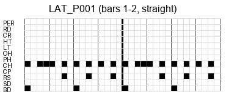

# Source MIDI Files and Pattern Conversion Workflow

## 1. Original MIDI Files Used for Pattern Generation

The 14 Type-0 MIDI files in the `original-midi-files` directory were obtained from the package titled
**“200 instant drum patterns contents”**, which was introduced on the following website:

- https://discuss.cakewalk.com/topic/648-460-free-gm-midi-drum-patterns/

The original URL referenced in that forum post is no longer valid. However, it is known to have been archived at the following location, which is still accessible as of **December 13, 2025**:

- https://web.archive.org/web/20190305092857/http://www.fivepinpress.com/drum_patterns.html

These drum patterns are widely believed to be MIDI conversions of patterns published in:

- **Rene-Pierre Bardet**, *200 Drum Machine Patterns* (1986)  
  https://www.amazon.com/Drum-Machine-Patterns-Rene-Pierre-Bardet/dp/0881886327

along with its supplement:

- *260 Drum Machine Patterns*

To quickly inspect the contents of these MIDI files, they can be opened and played in any suitable
sequencer or DAW. As a lightweight online alternative, the following HTML-based MIDI player is recommended.
It provides a visual representation of the pattern, which is helpful for understanding the structure:

- https://cifkao.github.io/html-midi-player/

In addition, the following website provides free MIDI drum files that may also be useful:

- https://mididrumfiles.com/free-samples/

---

## 2. MIDI-to-Pattern Conversion Process

Type-0 MIDI files containing drum performance data are processed as follows:

1. The MIDI file is split into **2-bar segments**.
2. Each segment is converted into an **ADT** file.
3. The ADT file is then compiled into a final **ADP** file.

The following scripts are used in this pipeline:

- `adc-split-drum-2bar-save.py`
- `adc-mid2adt.py`
- `adc-adt2adp.py`

Before splitting, it is recommended to verify that:
- The input MIDI file is **Type 0**.
- Drum events are on **Channel 10**.
- Note numbers fall within the valid **GM drum range**.

To run the following examples, please adjust the script and MIDI file paths to your working environment.

### MIDI Validation

The script `adc-midtool.py` can be used to inspect all MIDI files in a given directory:

```bash
python ..\tools\adc-midtool.py --check-drums
```

Example output:

```
GM Drum Range Validation (Channel 10: 35–81)
[DRUM-OK]   2AFROCUB.MID
```

Summary table excerpt:

```
name         | size_bytes | format | ntrks | division | duration_sec | is_8dot3 | channels_used | gm_drum_bad_notes
---------------------------------------------------------------------------------------------------------------
2AFROCUB.MID | 2694       | 0      | 1     | 240      | 70.441       | True     | [9]           | []
```

---

### Detailed MIDI Report

For a comprehensive analysis of a single MIDI file, `adc-mid2report.py` can be used:

```bash
python ..\tools\adc-mid2report.py .\2AFROCUB.MID
```

This generates a detailed report including:
- Tempo map
- Time signatures
- Channel usage
- ADT conversion hints
- Subdivision (grid) analysis

---

### Pattern Naming and Genre Handling

Each 2-bar pattern generated from a MIDI file is named using the following convention:

```
<GEN>_Pnnn.(MID|ADT|ADP)
```

- `<GEN>`: a 3-letter genre code
- `Pnnn`: a zero-padded pattern number starting from `001`

[The genre code](./genre_code_table.md) is automatically inferred from the input MIDI filename by
`adc-split-drum-2bar-save.py`. It can be overridden using the `--genre GENRE` option.

To check the inferred genre without generating any output files:

```bash
python ..\tools\adc-split-drum-2bar-save.py .\2AFROCUB.MID --print-genre-only
```

Example output:

```
[GENRE] Inferred from filename '2AFROCUB.MID' : LAT
```

If patterns of the same genre already exist in the current directory, care should be taken to avoid
overwriting existing files. In such cases, it is recommended to:
1. Use `--print-genre-only` to determine the genre.
2. Specify an appropriate starting index using the `--start START` option.

---

### Pattern Visualization

For visual inspection, the `--export-grid` option can be used to generate a grid-style PNG image
for each pattern.



If `--export-grid` and `--grid-pdf` are specified together:
- All generated grid PNGs for a given input MIDI file are collected into a single multi-page PDF.
- After successful PDF creation, the intermediate PNG files are automatically deleted.

The `original-midi-files` directory contains PDFs generated using this workflow for each input
MIDI file.

### (optional) Pattern Deduplication and Similarity analysis

Reducing identical or near-identical drum patterns is ultimately the responsibility of the user.
To assist with this process, it is recommended to:

- Refer to the generated **PDF grid visualizations**, and/or
- Use the script `adc-drum-sim-matrix.py` to verify the similarity of pattern files (`.MID`).

> Note: This script evaluates **note-on event structure only**.  
> Differences in **velocity values are intentionally ignored**.

Individual pattern files may be listed explicitly as arguments, or supplied using wildcards.

---

## Example: Similarity Check Using Wildcards

```bash
python ..\..\tools\adc-drum-sim-matrix.py .\DRM_P01?.MID
```

---

## Hamming Similarity Matrix

> **Hamming similarity** measures how similar two binary drum grids are  
> (`1.000` indicates identical note placement).

```
================================================================================
Hamming similarity matrix (1.000 = identical)
================================================================================
           0      1      2      3      4      5      6      7      8
  0:   1.000  0.979  0.911  0.938  0.948  0.875  0.875  0.880  0.880
  1:   0.979  1.000  0.901  0.927  0.938  0.865  0.865  0.870  0.870
  2:   0.911  0.901  1.000  0.943  0.943  0.932  0.932  0.906  0.906
  3:   0.938  0.927  0.943  1.000  0.990  0.906  0.906  0.932  0.932
  4:   0.948  0.938  0.943  0.990  1.000  0.906  0.906  0.932  0.932
  5:   0.875  0.865  0.932  0.906  0.906  1.000  1.000  0.870  0.870
  6:   0.875  0.865  0.932  0.906  0.906  1.000  1.000  0.870  0.870
  7:   0.880  0.870  0.906  0.932  0.932  0.870  0.870  1.000  1.000
  8:   0.880  0.870  0.906  0.932  0.932  0.870  0.870  1.000  1.000
```

### Index → Filename

```
0: DRM_P010.MID
1: DRM_P011.MID
2: DRM_P012.MID
3: DRM_P013.MID
4: DRM_P014.MID
5: DRM_P015.MID
6: DRM_P016.MID
7: DRM_P017.MID
8: DRM_P018.MID
```