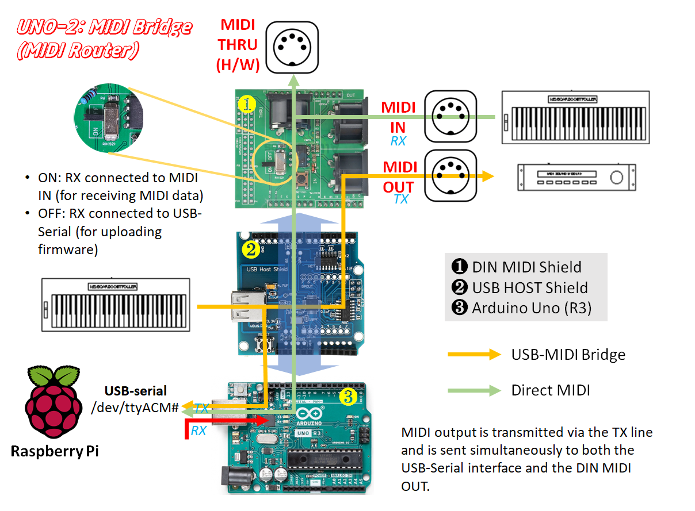

# Ardule USB MIDI Router (UNO-2 Firmware)

**First Created:** 2026-01-26  
**Last Updated:** 2026-04-23 (v0.6) 

---

## 1. Overview

**Ardule USB MIDI Router** (formerly Ardule USB MIDI host) is a dedicated **USB + DIN MIDI router/bridge firmware** built on Arduino UNO with a USB Host Shield (`UNO-2`).

It now functions as a **unified MIDI ingput device**, capable of receiving:

- USB MIDI devices (via USB Host Shield)
- DIN MIDI devices (via UART RX)

and forwarding them to:

- DIN MIDI OUT (hardware TX)
- USB-serial interface (to host systems like Raspberry Pi)

---

## 2. System Concept

<p>
  
</p>

The firmware has evolved beyond a simple USB-to-DIN converter and now operates effectively as a:

> **MIDI Router / MIDI Bridge**

---
### Terminology (Important)

To avoid confusion, the following terms are used consistently:

- **UNO-2 (hardware)**  
  The physical Arduino UNO-based device with USB Host Shield and DIN MIDI interfaces.

- **UNO-2 firmware (this project)**  
  The embedded software running on the Arduino, responsible for handling MIDI input (USB/DIN), routing data, and forwarding raw MIDI bytes over USB serial.

- **MIDI bridge program (host-side)**  
  A software component running on the host system (e.g., Raspberry Pi), such as [`uno-midi-bridge`](https://github.com/jeong0449/uno-midi-bridge),  
  which converts raw serial MIDI data into ALSA MIDI streams.

These components together form the complete MIDI input pipeline used in the Fluid Ardule system.

---

## 3. Relationship to Fluid Ardule

Within the separate project [**Fluid Ardule**](https://github.com/jeong0449/FluidArdule), this device is commonly referred to as:

> **UNO-2**

Fluid Ardule is a modular DIY sound module system built around:

- Raspberry Pi (synthesis engine, e.g., FluidSynth)
- Arduino-based controllers and MIDI engines

In this architecture:

- **UNO-1** → UI controller  
- **UNO-2 (this firmware)** → MIDI input / routing engine  

UNO-2 is responsible for:

- Receiving MIDI from multiple sources (USB / DIN)
- Forwarding clean MIDI streams to the synthesis engine
- Acting as a reliable bridge between hardware MIDI and software synthesis

---

## 4. Hardware configuration

- Arduino UNO
- USB Host Shield (MAX3421E)
- USB MIDI keyboard
- DIN MIDI IN (optional)
- DIN MIDI OUT

Key points:

- DIN OUT uses hardware serial TX (D1) at 31250 bps
- DIN IN uses UART RX (D0)
- USB-serial shares the same hardware UART

---

## 5. Key architectural change (v0.5)

### Previous behavior (v0.4)
- USB MIDI → DIN OUT

### Current behavior (v0.5)
- USB MIDI → Serial
- DIN MIDI IN → Serial

👉 Both inputs are merged and forwarded to:
- DIN OUT
- USB-serial

This transforms UNO-2 into a:

> **Unified USB + DIN MIDI router/bridge**

---

## 6. MIDI handling notes

- USB MIDI packets are parsed using CIN/status logic
- Running status is not generated
- **SysEx messages are NOT supported (ignored)**
  - (CIN 0x4 / 0x6 / 0x7 not processed)

---

## 7. Limitations

- USB and DIN inputs are merged (no source distinction)
- DIN IN is echoed to DIN OUT (possible loop depending on setup)
- SysEx messages are not handled
- Only single USB MIDI device supported

---

## 8. USB-Serial MIDI usage (Important)

All MIDI data is also output via the UNO's USB-serial interface.

This raw MIDI stream is intended to be consumed by host-side software (e.g., on a Raspberry Pi), where it can be converted into standard ALSA MIDI streams.

Typical usage:

1. Read raw MIDI bytes from `/dev/serial/by-id/...`
2. Converting them to ALSA MIDI using a bridge program, [`uno-midi-bridge`](https://github.com/jeong0449/uno-midi-bridge)

Example workflow:

```
UNO-2 → USB-serial → MIDI bridge (C or Python) → ALSA sequencer → FluidSynth
```

---

## 9. LCD and latency considerations

- USB polling must remain responsive
- LCD updates are disabled during MIDI activity
- Restored after idle period

---

## 10. Version note

### v0.5
v0.5 represents a major architectural evolution:

> From: USB MIDI converter  
> To:   unified USB + DIN MIDI router/bridge

### v0.6
v0.6 formalizes the terminology and defines the device as a:

> **MIDI Router**

The term *router* is now used consistently to describe the role of UNO-2 as a unified MIDI input and routing engine,  
while the term *bridge* is reserved for host-side software that converts serial MIDI into ALSA MIDI.

---

## 11. Future work

- Source separation (USB vs DIN)
- SysEx support
- Multiple device handling
