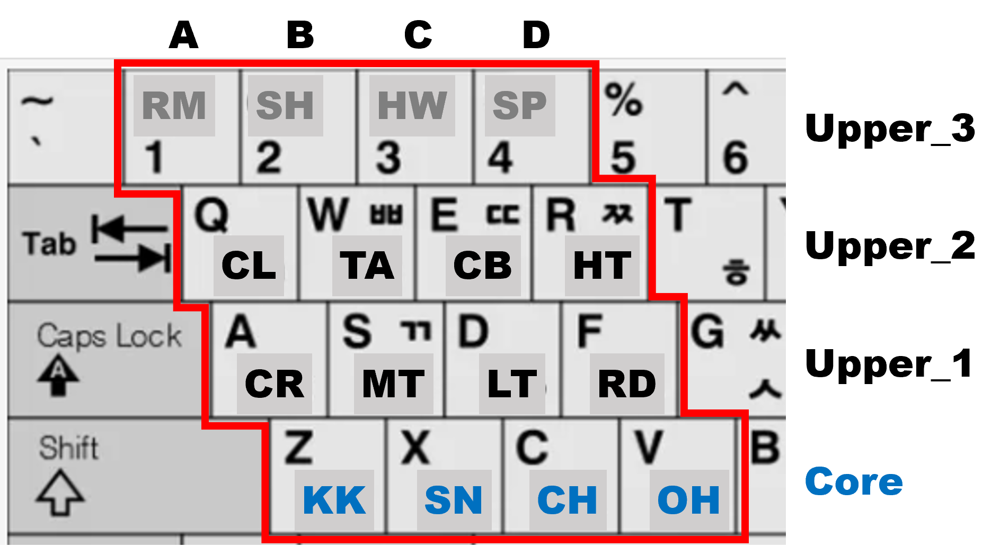

# APS Drum Instrument Sets & Pad Mapping — Reference Specification

* **Version:** v1.1 
* **Creation Date:** 2026-02-09 (updated 2026-07-27) 
* **Status:** Reference / Implementation-level Specification

---

## 1. Scope and Purpose

This document defines the **reference drum instrument sets and pad mappings** used by APS-based editors and controllers.
This specification is **non-normative with respect to the ADT format**.
ADT intentionally defines *instrument slots* without binding them to concrete instrument identities.

---

## 2. Terminology

* **ADT**: Ardule Drum Pattern Text format
* **APS**: Ardule Pattern Studio
* **Instrument Slot**: A logical drum role defined in ADT (maximum 12)
* **Instrument Set**: A concrete assignment of musical instruments to slots
* **Pad Mapping**: Physical controller pad positions mapped to instruments

---

## 3. Instrument Categories

APS instruments are grouped by functional role rather than timbre or MIDI number.

| Category           | Description                                  |
| ------------------ | -------------------------------------------- |
| Core               | Timekeeping backbone, always preserved       |
| Fills / Transition | Drum fills and sectional transitions         |
| Rhythmic Perc      | Percussion directly shaping groove           |
| Color / FX         | Texture, accents, and decorative sounds      |
| Legacy / Optional  | Historically present or optional instruments |

---

## 4. Reference Instrument Sets

### 4.1 Core Instrument Set

The **Core Instrument Set** consists of the instruments classified under the
**Core** category in the reference table.

It is **not** a complete instrument set. Instead, it defines the mandatory
subset shared by all APS 12-slot instrument sets.

Every APS 12-slot instrument set SHALL include all Core instruments.

### 4.2 Legacy UI 12 (Default)

The **Legacy UI 12** defines the default 12-slot instrument set used by current
APS implementations, including APS editors, StepSeq, and ADP playback.

* Maximum of 12 instruments
* Includes all core drum instruments
* Default slot map for ADP patterns unless another slot map is explicitly specified
* Forms the baseline for automatic row registration

### 4.3 Additional Slot Maps

APS may define additional 12-slot instrument sets for specialized musical styles
or workflows. Each additional slot map SHALL preserve the canonical ordering defined in
Section 5.

Examples include:

* Latin 12
* Electronic 12
* Brush 12

These slot maps are selected explicitly and remain fully compatible with the
ADT slot model.

### 4.4 MPK MINI Pad 16 Set

The **MPK MINI Pad 16 Set** defines a reference physical mapping for 4×4 pad controllers.

* Core instruments occupy the lower pad row
* Upper rows are organized by functional category

### Historical Note — APS Default 12

During the early design of APS, the **APS Default 12** was envisioned as a future
canonical 12-slot instrument set independent of any particular user interface.
It was intended to provide a clean, musically balanced default while allowing
multiple alternative slot maps to coexist.

As the project evolved, however, the original **Legacy UI 12** layout became the
de facto standard across APS editors, StepSeq, ADP playback, and related tools.
Its widespread adoption and backward compatibility made it the natural default
instrument set for the APS ecosystem.

Consequently, the concept of **APS Default 12** was retired before formal
standardization. The name remains reserved for possible future use should a new
canonical instrument set ever become desirable.

---

## 5. Reference Table

### 5.1 Ordering Rule

For every APS 12-slot instrument set, the instrument order is normative.

When an instrument set selects a subset of instruments from the reference table,
the relative ordering defined below SHALL be preserved.

Implementations MUST NOT reorder selected instruments.

This guarantees consistent slot numbering across ADT editors, ADP encoders,
and playback engines.

| Category           | Instrument     | Legacy UI 12 | (APS Default 12) | MPK MINI Pad 16 | Pad Location |
| ------------------ | -------------- | ------------- | -------------- | --------------- | ------------ |
| Core               | KK (36) KICK   | O             | O              | O               | Core         |
|                    | SN (38) SNARE  | O             | O              | O               | Core         |
|                    | CH (42) HH_CL  | O             | O              | O               | Core         |
|                    | OH (46) HH_OP  | O             | O              | O               | Core         |
| Fills / Transition | MT (47) TOM_M  | O             | O              | O               | Upper_1B     |
|                    | LT (45) TOM_L  | O             | O              | O               | Upper_1C     |
|                    | HT (50) TOM_H  | O             | O              | O               | Upper_2D     |
|                    | CR (49) CRASH  | O             | O              | O               | Upper_1A     |
|                    | RD (51) RIDE   | O             | O              | O               | Upper_1D     |
| Rhythmic Perc      | CL (39) CLAP   | O             | O              | O               | Upper_2A     |
|                    | TA (54) TAMB   |               | O              | O               | Upper_2B     |
|                    | CB (56) COWBL  |               | O              | O               | Upper_2C     |
| Color / FX         | RM (37) RIM    | O             |                | O               | Upper_3A     |
|                    | SH (82) SHAKR  |               |                | O               | Upper_3B     |
|                    | HW (76) WBLK_H |               |                | O               | Upper_3C     |
|                    | SP (55) SPLASH |               |                | O               | Upper_3D     |
| Legacy / Optional  | PH (44) HH_PED | O             |                |                 | —            |

#### 5.1.1 Instrument Naming

The instrument definition consists of three independent components:

```text
<SHORT>@<MIDI_NOTE>,<LONG_NAME>
```

Example:

```text
SN@38,SNARE
```

where:

- `SHORT` is a two-character mnemonic used for compact pattern notation.
- `MIDI_NOTE` is the General MIDI percussion note number and is the authoritative instrument identifier.
- `LONG_NAME` is a human-readable display name.

Only the MIDI note number determines the instrument's musical meaning. The `SHORT` and `LONG_NAME` fields are descriptive metadata and may be changed in future revisions without affecting playback compatibility.

For example, the following definitions are musically equivalent:

```text
RM@37,RIM
RM@37,SIDEST
SS@37,SIDEST
```

All three represent General MIDI Note 37 and therefore produce identical playback.

##### Possible Future Name Updates

The following naming changes may be considered in future revisions to improve readability while preserving complete compatibility.

| Current | Proposed | Notes |
|---------|----------|-------|
| `RM@37,RIM` | `RM@37,SIDEST` | Reflects the GM instrument name (Side Stick). |
| `CB@56,COWBL` | `CB@56,COWBEL` | Uses the full six-character abbreviation. |
| `SH@82,SHAKR` | `SH@82,SHAKER` | Improves readability while remaining within six characters. |

These are documentation improvements only. Existing ADT files remain fully compatible because instrument identity is determined solely by the MIDI note number.

### APS StepSeq - 4x4 Keyboard Grid Layout
<p align="center">
  
</p>

---

## 6. Design Rationale (Informative)

* **Core instruments are immutable** and must always remain visible in StepSeq.
* **Legacy UI 12** balances expressive power with UI and hardware constraints.
* Pad layouts prioritize *physical playability* and *real drum-set ergonomics* over pitch ordering.

---

## 7. Versioning Policy

This specification follows independent semantic versioning.

* Minor versions: Instrument additions or reclassification
* Major versions: Structural or conceptual changes

---

## 8. References

* ADT v2.2 Specification
* APS User Manual
* AKAI MPK MINI Controller Documentation
